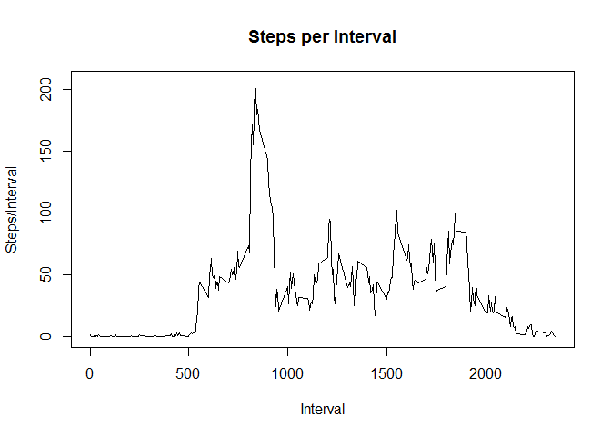

# Reproducible Research: Peer Assessment 1


## Loading and preprocessing the data

1. Load the data  


```r
if (!file.exists("activity.csv")){
  unzip(zipfile="activity.zip")
}  
data1 <- read.csv("activity.csv", sep = ",", colClasses = c("numeric", "Date", "numeric"))
```

2. Process/Transform the data


```r
data1$interval <- as.factor(data1$interval)
```

## What is mean total number of steps taken per day?

Calculate the mean total number of steps taken per day.  

```r
dailySteps <- aggregate(steps ~ date, data1, sum,na.rm=TRUE)
```

Create a histogram of the total number of steps taken per day.


```r
hist(dailySteps$steps, 
     col = "green",
     breaks = seq(from = 0, to = 27000, by = 1500),
     main = "Histogram of Daily Steps", 
     xlab = "Total Daily Steps",
     ylab = "Timer per day")
```


Calculate the mean and median steps taken daily  


```r
meanSteps <- mean(dailySteps$steps,na.rm=T)
medianSteps <- median(dailySteps$steps,na.rm=T)
```

Print the mean and median daily steps  


```r
print(paste("The Mean number of daily steps is",round(meanSteps,2)))
```

```
## [1] "The Mean number of daily steps is 10766.19"
```

```r
print(paste("The median number of daily steps is", round(medianSteps,2)))
```

```
## [1] "The median number of daily steps is 10765"
```

## What is the average daily activity pattern?

Calculate steps per interval  


```r
perIntervalSteps <- aggregate(data1$steps,
                              by = list(interval = data1$interval),
                              FUN = mean,
                              na.rm = T)
```

Convert Interval to integer and add column names

```r
perIntervalSteps$interval <- as.integer(levels(perIntervalSteps$interval)[perIntervalSteps$interval])
colnames(perIntervalSteps) <- c("interval", "steps")
```

Make Type 1 plot of steps per period  


```r
plot(perIntervalSteps$interval, perIntervalSteps$steps,
     type = "l",
     main = "Steps per Interval",
     xlab = "Interval",
     ylab = "Steps/Interval")
```



Find the interval with the highest number of steps  


```r
maxStepInterval <- perIntervalSteps[which.max(  
  perIntervalSteps$steps),]

print(paste("The interval with max steps is Interval number",maxStepInterval$interval,
            "with", round(maxStepInterval$steps,0),"steps."))
```

```
## [1] "The interval with max steps is Interval number 835 with 206 steps."
```


## Imputing missing values


## Are there differences in activity patterns between weekdays and weekends?
