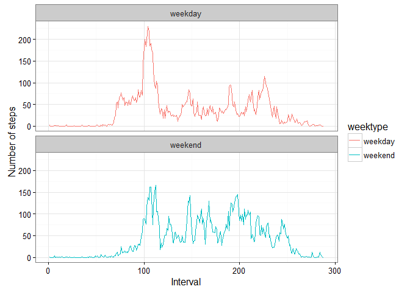

# Reproducible Research: Peer Assessment 1

```r
#
# Load needed libraries
#
library(ggplot2)
```

```
## Warning: package 'ggplot2' was built under R version 3.2.4
```

```r
library(dplyr)
```

```
## 
## Attaching package: 'dplyr'
```

```
## The following objects are masked from 'package:stats':
## 
##     filter, lag
```

```
## The following objects are masked from 'package:base':
## 
##     intersect, setdiff, setequal, union
```

## Loading and preprocessing the data

1. Load the data  


```r
if (!file.exists("activity.csv")){
  unzip(zipfile="activity.zip")
}  
data1 <- read.csv("activity.csv", sep = ",", colClasses = c("numeric", "Date", "numeric"))
```

2. Process/Transform the data


```r
data1$interval <- as.factor(data1$interval)
```

## What is mean total number of steps taken per day?

Calculate the mean total number of steps taken per day.  

```r
dailySteps <- aggregate(steps ~ date, data1, sum,na.rm=TRUE)
```

Create a histogram of the total number of steps taken per day.


```r
hist(dailySteps$steps, 
     col = "green",
     breaks = seq(from = 0, to = 27000, by = 1500),
     main = "Histogram of Daily Steps", 
     xlab = "Total Daily Steps",
     ylab = "Timer per day")
```


Calculate the mean and median steps taken daily  


```r
meanSteps <- mean(dailySteps$steps,na.rm=T)
medianSteps <- median(dailySteps$steps,na.rm=T)
```

Print the mean and median daily steps  


```r
print(paste("The Mean number of daily steps is",round(meanSteps,2)))
```

```
## [1] "The Mean number of daily steps is 10766.19"
```

```r
print(paste("The median number of daily steps is", round(medianSteps,2)))
```

```
## [1] "The median number of daily steps is 10765"
```

## What is the average daily activity pattern?

Calculate steps per interval  


```r
perIntervalSteps <- aggregate(data1$steps,
                              by = list(interval = data1$interval),
                              FUN = mean,
                              na.rm = T)
```

Convert Interval to integer and add column names

```r
perIntervalSteps$interval <- as.integer(levels(perIntervalSteps$interval)[perIntervalSteps$interval])
colnames(perIntervalSteps) <- c("interval", "steps")
```

Make Type 1 plot of steps per period  


```r
plot(perIntervalSteps$interval, perIntervalSteps$steps,
     type = "l",
     main = "Steps per Interval",
     xlab = "Interval",
     ylab = "Steps/Interval")
```


Find the interval with the highest number of steps  


```r
maxStepInterval <- perIntervalSteps[which.max(  
  perIntervalSteps$steps),]

print(paste("The interval with max steps is Interval number",maxStepInterval$interval,
            "with", round(maxStepInterval$steps,0),"steps."))
```

```
## [1] "The interval with max steps is Interval number 835 with 206 steps."
```


## Imputing missing values

Find the number of missing values  


```r
numMissing <- sum(is.na(data1$steps))
```

Fill missing data with mean for that interval  


```r
data_cmplt <- data1
```

Create a list of intervals with and without values  


```r
missingValueList <- is.na(data_cmplt$steps)
```
Calculate mean no. of steps for each interval  


```r
intervalAvgs <- tapply(data_cmplt$steps, data_cmplt$interval, mean, na.rm=TRUE, simplify=TRUE)
```

Now fill the missing values with calculated average value  


```r
data_cmplt$steps[missingValueList] <- intervalAvgs[as.character(data_cmplt$interval[missingValueList])]
```


```r
#
# Make sure there are no missing values
#
if (sum(is.na(data_cmplt$steps)) > 0){
  print(paste("There are still missing values."))
}

#
# Calculate Total steps for complete data
#

dailyStepsCmplt <- aggregate(steps ~ date, data_cmplt, sum,na.rm=TRUE)

#
# Plot histogram steps taken daily
#

hist(dailyStepsCmplt$steps, 
     col = "blue",
     breaks = seq(from = 0, to = 27000, by = 1500),
     main = "Histogram of Daily Steps", 
     xlab = "Total Daily Steps",
     ylab = "Timer per day")
```


```r
#
# Calculate total steps taken daily
#

dailyStepsCmplt <- aggregate(steps ~ date, data_cmplt, sum,na.rm=TRUE)

#
# Calculate the mean and median steps taken daily for complete data
#
meanStepsCmplt <- mean(dailyStepsCmplt$steps,na.rm=T)
medianStepsCmplt <- median(dailyStepsCmplt$steps,na.rm=T)
#
# Print the mean and median daily steps
#
print(paste("The Mean number of daily steps is",round(meanStepsCmplt,2)))
```

```
## [1] "The Mean number of daily steps is 10766.19"
```

```r
print(paste("The median number of daily steps is", round(medianStepsCmplt,2)))
```

```
## [1] "The median number of daily steps is 10766.19"
```


## Are there differences in activity patterns between weekdays and weekends?


```r
#
# Calculate day of week and then sort into weekday/weekend
#
data_cmplt <- mutate(data_cmplt, weektype = ifelse(weekdays(data_cmplt$date) == "Saturday" | weekdays(data_cmplt$date) == "Sunday", "weekend", "weekday"))
data_cmplt$weektype <- as.factor(data_cmplt$weektype)

#
# Now create plots of weekday and weekend steps/interval over entire day
#
intvlTotals <- data_cmplt %>%
  group_by(interval, weektype) %>%
  summarise(steps = mean(steps))

# Interval needs to be numeric to plot
intvlTotals$interval <- as.numeric(intvlTotals$interval)

ggplot(intvlTotals, aes(x=interval, y=steps, color = weektype)) + 
  geom_line(aes(group=weektype)) + 
  facet_wrap(~weektype, nrow=2, ncol=1) +
  labs(x="Interval", y="Number of steps") +
  theme_bw()
```



Based on the plots, it appears that activity ramps up more slowly on
weekends, but there is more activity during the day on weekends and
activity tapers off very rapidly on weekends.
